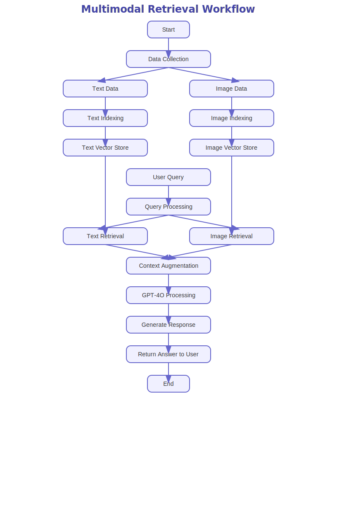
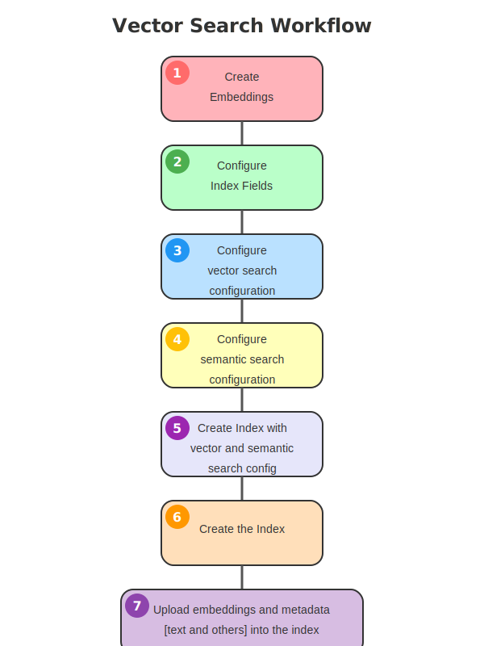
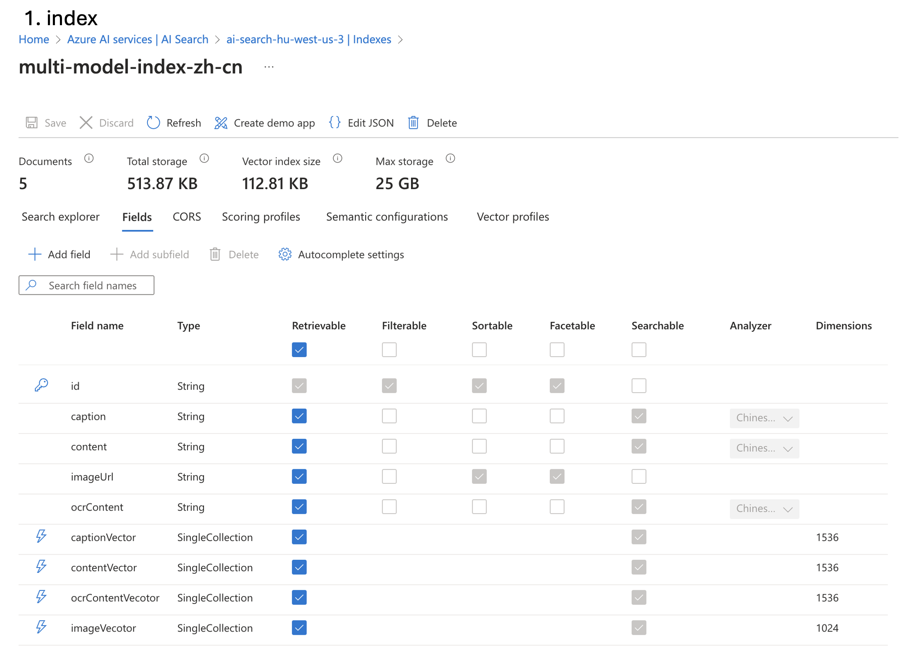
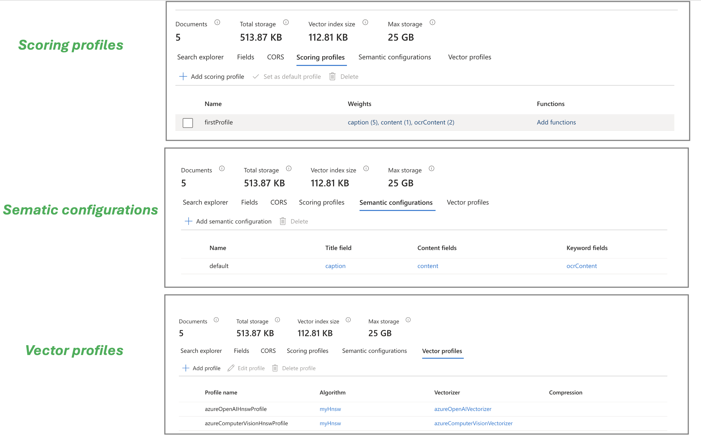
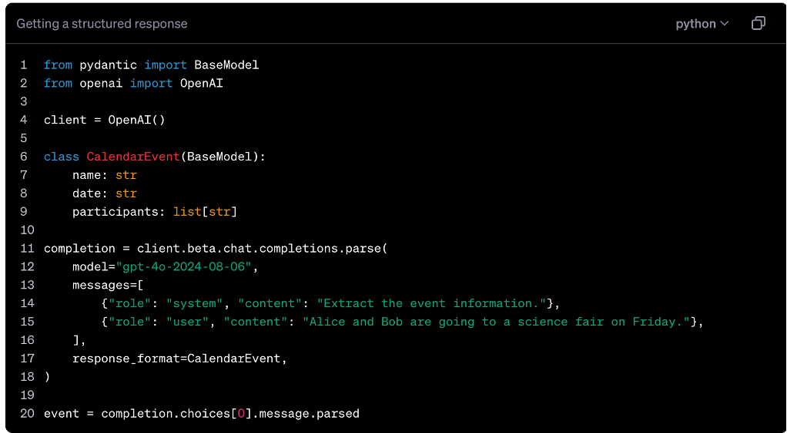
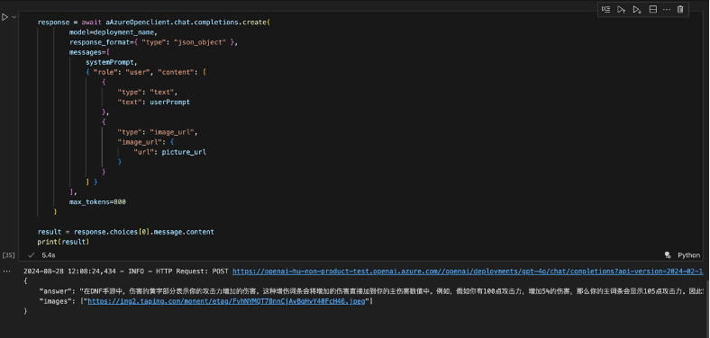

# 图片和文本的跨模态检索

客户有大量的图片和文本数据，需要利用多模态的检索方式来找到相关的图片或者文本。
使用场景包括：
1. 给出一段文字，要找到最相关的文字和图片内容。
2. 给出一张图片，要找到最相关的文字和图片内容。
3. 给出一段文字和图片，要找到最相关的文字和图片内容。
总成一句话，就是文字和图片多模态的检索。

## 方案中需要解决的几个主要问题

1. 对于本身信息不足的图片等数据处理和丰富。
2. 多模态的图片和文本的向量生成。
3. 在不同模态和所搜结果之后的融合和召回评分。
4. 多模态检索结果的展示。

## 整体的设计流程图如下



## 中间件选型

1. 图片和文本的丰富，使用azure openai的 gpt-4o，azure computer vision和azure document intelligence来实现。
2. 图片和文本的向量生成，同时使用azure openai的embedding和azure computer vision的embedding来实现。
3. 在不同模态和所搜结果之后的融合和召回评分，使用azure AI search的关键字检索，向量搜索和语义重排名来实现。
4. 多模态检索结果的展示，使用azure openai的structed data保证输出结果。

### 数据的丰富处理(针对对于本身信息不足的图片等数据处理和丰富，以及多模态的图片和文本的向量生成)

1. 通过gpt-4o针对当前主题，进行描述展开，作为content主要内容

gpt-4o本身的输入是可以多模态的，但是输出是文本的，所以需要使用gpt-4o对图片进行描述，作为content主要内容，特别是那种图片自身没有文字信息，或者文字信息不多的情况下，这种方式可以大大提高检索的准确性。

2. 通过azure computer vision 对图片进行分析，提取图片的caption作为关键字

azure computer vision 可以对图片进行分析，提取图片的caption作为关键字，这种方式可以大大提高关键字检索的准确性。

3. 通过azure document intelligence 对文档进行分析，提取文档的OCR内容作为文档的丰富内容，同样作为关键字等

正对那种图片中，本身包含一些有用信息的，比如logo，图片中包含的文字信息等，可以提高检索的准确性。

4. 通过azure computer vision 里面多模态的embedding，将图片进行embedding，生成向量

	•	定义：多模态嵌入 API 生成文本和图像等多种数据的向量表示。
	•	应用场景：常用于内容理解、图像描述、视觉问答以及对话系统。
	•	主要供应商：包括 Amazon、Aleph Alpha、Google Cloud、Microsoft Azure、OpenAI 和 Replicate 等。
	•	关键性能因素：包括数据质量、模型结构、跨模态关系处理和特定领域的适应性。

关于azure computer vision 的embedding，可以参考如下链接：

https://learn.microsoft.com/zh-cn/azure/ai-services/computer-vision/how-to/image-retrieval?tabs=python

5. 通过azure openai 的embedding，将文本进行embedding，生成向量

可以选择不同的embedding模型，包括text-embedding-ada-002,text-embedding-3-small,text-embedding-3-large等。相信他们在文字方面的能力是要强于azure computer vision的embedding的。


### 索引设计与实现（回应：在不同模态和所搜结果之后的融合和召回评分）




index field的定义如下：



```python
fields=[
                SimpleField(name="id", type=SearchFieldDataType.String, key=True,searchable=False, filterable=True, sortable=True, facetable=True),
                SearchableField(name="caption", type=SearchFieldDataType.String, analyzer_name="zh-Hans.microsoft"),# caption of the picture
                SearchableField(name="content", type=SearchFieldDataType.String, analyzer_name="zh-Hans.microsoft"),# context of the picture from gpt-4o
                SimpleField(name="imageUrl", type=SearchFieldDataType.String,Searchable=False,filterable=False, sortable=True, facetable=True),# url of the picture
                SearchableField(name="ocrContent", type=SearchFieldDataType.String,analyzer_name="zh-Hans.microsoft"), # context of the picture from document intelligence
                SearchField(name="captionVector", 
                            type=SearchFieldDataType.Collection(SearchFieldDataType.Single),
                            hidden=False, 
                            searchable=True, 
                            filterable=False, 
                            sortable=False, 
                            facetable=False,
                            vector_search_dimensions=1536, 
                            vector_search_profile_name="azureOpenAIHnswProfile"), #  the caption's vector of the picture
                SearchField(name="contentVector", 
                            type=SearchFieldDataType.Collection(SearchFieldDataType.Single),
                            hidden=False, 
                            searchable=True, 
                            filterable=False, 
                            sortable=False, 
                            facetable=False,
                            vector_search_dimensions=1536, 
                            vector_search_profile_name="azureOpenAIHnswProfile"),  # content vector of the picture from gpt-4o
                SearchField(name="ocrContentVecotor", 
                            type=SearchFieldDataType.Collection(SearchFieldDataType.Single),
                            hidden=False, 
                            searchable=True, 
                            filterable=False, 
                            sortable=False, 
                            facetable=False,
                            vector_search_dimensions=1536, 
                            vector_search_profile_name="azureOpenAIHnswProfile"),  # content vector of the picture from document intelligence
                SearchField(name="imageVecotor", 
                            type=SearchFieldDataType.Collection(SearchFieldDataType.Single),
                            hidden=False, 
                            searchable=True, 
                            filterable=False, 
                            sortable=False, 
                            facetable=False,
                            vector_search_dimensions=1024, 
                            vector_search_profile_name="azureComputerVisionHnswProfile")  # content vector of the picture from computer vision
            ]
```

retrieve 配置如下的定义如下：




```python
scoring_profile = ScoringProfile(
            name="firstProfile",
            text_weights=TextWeights(weights={
                                        "caption": 5, 
                                        "content": 1, 
                                        "ocrContent": 2}),
            function_aggregation="sum")
        scoring_profiles = []
        scoring_profiles.append(scoring_profile)

semantic_search=SemanticSearch(
                configurations=[
                    SemanticConfiguration(
                        name="default",
                        prioritized_fields=SemanticPrioritizedFields(
                            title_field=SemanticField(field_name="caption"),
                            content_fields=[
                                SemanticField(field_name="content")
                            ],
                            keywords_fields=[
                                SemanticField(field_name="ocrContent")
                            ]
                        ),
                    )
                ]
            )
            # 
vector_search=VectorSearch(
                algorithms=[
                    HnswAlgorithmConfiguration(
                        name="myHnsw")
                ],
                profiles=[
                    VectorSearchProfile(
                        name="azureOpenAIHnswProfile",
                        algorithm_configuration_name="myHnsw",
                        vectorizer="azureOpenAIVectorizer"),
                    VectorSearchProfile(
                        name="azureComputerVisionHnswProfile",
                        algorithm_configuration_name="myHnsw",
                        vectorizer="azureComputerVisionVectorizer")],
                vectorizers=[
                    AzureOpenAIVectorizer(
                        name="azureOpenAIVectorizer",
                        azure_open_ai_parameters=AzureOpenAIParameters(
                            resource_uri=os.environ.get("AZURE_OPENAI_ENDPOINT"),
                            deployment_id="text-embedding-ada-002",
                            model_name="text-embedding-ada-002",
                            api_key=os.environ.get("AZURE_OPENAI_API_KEY"))),
                    AIServicesVisionVectorizer(
                        name="azureComputerVisionVectorizer",
                        ai_services_vision_parameters=AIServicesVisionParameters(
                            resource_uri=os.environ.get("AZURE_COMPUTER_VISION_ENDPOINT"),
                            api_key=os.environ.get("AZURE_COMPUTER_VISION_KEY"),
                            model_version="2023-04-15"))
                ]
            )
```


### 检索和打分过程

1. 文本检索：

    • 关键词：将关键词映射到caption（标题）、content（内容）、ocrContent（OCR内容）,并使用BM25算法进行检索。

    • 文本嵌入：将文本内容映射到captionVector（标题向量）、contentVector（内容向量）、ocrContentVector（OCR内容向量）,并使用**HNSW （Hierarchical Navigable Small World分层可导航小世界）**算法进行向量检索。

2. 图像检索：

    • 图像多模态嵌入：将图像数据映射到imageVector（图像向量）和ImageVector,同样使用HNSW算法进行检索。

3. 混合检索：

    • 使用**混合倒数秩融合（RRF）**将检索结果进行结合,这种方法可以综合多个检索器的结果以提高准确性。

4. 语义重排序：

    • 将查询和检索结果进行语义重排序,并将重排序后的结果输入到微软托管的语言理解模型中。

5. 最终输出：

    • 通过GPT-4O模型,基于内容和问题生成最终的答案和相关图片。


### 检索结果的处理

关于GPT-4模型的支持情况，特别是结构化输出（Structured Outputs）的支持情况。以下是详细的说明：

	1.	支持的模型：
	结构化输出功能在最新的大型语言模型中可用，具体从以下版本开始支持：
        •	gpt-4o-mini-2024-07-18及之后的版本。
        •	gpt-4o-2024-08-06及之后的版本。

        
    
	2.	旧版本的处理方式：
	    •	对于较早的模型版本，如gpt-4-turbo及更早的版本，这些模型可能会改为使用JSON模式来处理输出。

     


### 完整代码实现
[multi-model-data-process-rag](https://github.com/huqianghui/multi-model-data-process-rag)
