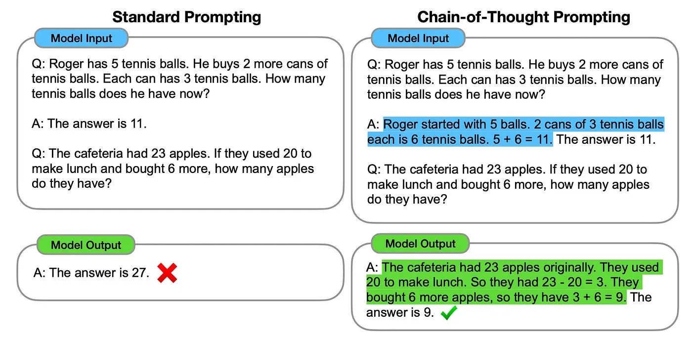

## Eight Prompt Engineering Implementations

Prompt Engineering 的学科非常简单易懂。然而，随着 LLM 环境的发展，提示正向得可编程方向，融合到更复杂的结构中。

从上图中分析，主要从如下八个方向来讨论：

1. Static Prompts 静态提示
2. Contextual Prompts 上下文提示
3. Prompt Templates 提示模板
4. Prompt Chaining 提示链接
5. Prompt Pipelines 提示管道
6. Agents 代理
7. Prompt Decomposition 提示分解
8. Modes / ChatML 模式 / ChatML

### Static Prompts 静态提示

静态提示就是没有模板、注入或外部的纯文本。

静态提示可以遵循零、单或少例子学习方法。通过在提示中包含示例数据来遵循一次性或少量学习方法，LLMs得到了极大的增强。

### Contextual Prompts 上下文提示

生成响应时，上下文提示提供对 LLM。上下文提示在很大程度上否定了 LLM 幻觉。

### Prompt Templates 提示模板

静态提示的下一步是提示模板化。
静态提示将转换为模板，其中键值将替换为占位符。占位符在运行时替换为应用程序值/变量。
在下面的 DUST 模板示例中，您可以看到 ${EXAMPlES：question}、${EXAMPlES：answer} 和 ${QUESTIONS：question} 的占位符，这些占位符在运行时会替换为值。

### Prompt Chaining 提示链

提示链，也称为大型语言模型 （LLM）链是创建由一系列模型调用组成的链的概念。这一系列的调用彼此紧随其后，一条链的 output 作为另一条链的 input。
每个链都旨在针对小型且范围明确的子任务，因此使用单个 LLM 来寻址任务的多个排序子组件。
Chain of Mind 提示的原理不仅用于 chaining，还用于 Agents 和 Prompt Engineering。
思维链提示是将复杂的任务分解成精致的小任务，直到最终答案的概念。

### Prompt Pipelines 提示管道

管道由触发器启动或启动;根据某些事件和参数，遵循一个流，从而产生一个输出。
对于提示管道，流在大多数情况下由用户请求启动。该请求将定向到特定的提示模板。
预定义提示模板中的变量或占位符将填充（也称为提示注入）来自用户的问题，以及要从知识存储中搜索的知识。

### Agents 代理

对于 LLM 相关操作，显然需要自动化。目前，这种自动化以所谓的代理形式出现。
提示链接是执行预先确定和设置的操作序列。
Agent 的吸引力在于 Agent 不遵循预定的事件顺序。代理可以保持高度的自主性。
代理可以使用一组工具，属于这些工具范围的任何请求都可以由代理处理。执行管道为 Agent 提供了自主权，可能需要多次迭代，直到 Agent 达到 Final Answer。

### Prompt Decomposition 提示分解

思维链提示使大型语言模型 （LLMs处理常识推理和算术等复杂任务。
通过快速工程建立思维链推理并相应地指示 LLM 实现起来非常简单。

下面是一个非常好的图，左侧是标准 LLM 提示，右侧是思链提示。

Chain-of-Thought Prompting 特别有用的是，通过分解 LLM 输入和 LLM 输出，它创建了一个洞察和解释的窗口。

### Modes / ChatML

相信 ChatML 的引入 非常重要，原因如下LLMs是即时注入攻击(prompt injection attacks).

ChatML 将允许防止这些类型的攻击。

为了消除提示注入攻击，对话被分为以下层或角色：

- System 系统
- assistant 助理
- user, etc. 用户等。

OpenAI 处于以负责任的方式引导和管理 LLM。为创建应用程序制定基础标准。

