## 思维链与LLM
不论是预览版，还是完整版o1，都是通过大规模强化学习进行了训练，掌握了一种前沿的思维链CoT的推理方法。这种方法，不仅仅是简单地给出答案，而是像人类思考一样，逐步分析和推理。而且，o1系列模型的一个重大突破在于——安全性推理能力。当面对潜在的不安全提示词时，它能精准理解上下文，根据预设安全策略进行深度推理。

其他大语言模型也具有一定程度的逻辑推理能力，这种时候好像AI有了人的意识一样。而推理能力的关键也就在于——思维链（Chain of Thought，CoT）

#### 相关概念

- 语言智能可以被理解为“使用基于自然语言的概念对经验事物进行‘理解’以及在概念之间进行‘推理’的能力”,随着参数量的飞升，以Transformer 为基础架构的大规模语言模型以 “Chat”的方式逐渐向人们展现出了它的概念理解与概念推理的能力；

- 推理一般指根据几个已知的前提推导得出新的结论的过程，区别于理解，推理一般是一个“多步骤”的过程，推理的过程可以形成非常必要的“中间概念”，这些中间概念将辅助复杂问题的求解。

### 什么是思维链

Chain-of-Thought(CoT)是一种改进的Prompt技术，目的在于提升大模型LLMs在复杂推理任务上的表现，对于复杂问题尤其是复杂的数学题大模型很难直接给出正确答案。如算术推理（arithmetic reasoning）、常识推理（commonsense reasoning）、符号推理（symbolic reasoning）。COT通过要求模型在输出最终答案之前，显式输出中间逐步的推理步骤这一方法来增强大模型的算数、常识和推理能力。简单，但有效。

2022 年，在 Google 发布的论文《Chain-of-Thought Prompting Elicits Reasoning in Large Language Models》中首次提出思维链（Chain of Thought），思维链就是一系列中间的推理步骤(a series of intermediate reasoning steps)。通过让大模型逐步参与将一个复杂问题分解为一步一步的子问题并依次进行求解的过程可以显著提升大模型的性能。

思维链(CoT)提示过程呢是一种提示方法，它鼓励大语言模型解释其推理过程。 通过下图显示了 few shot standard prompt（左)与链式思维提示过程（右）的比较。
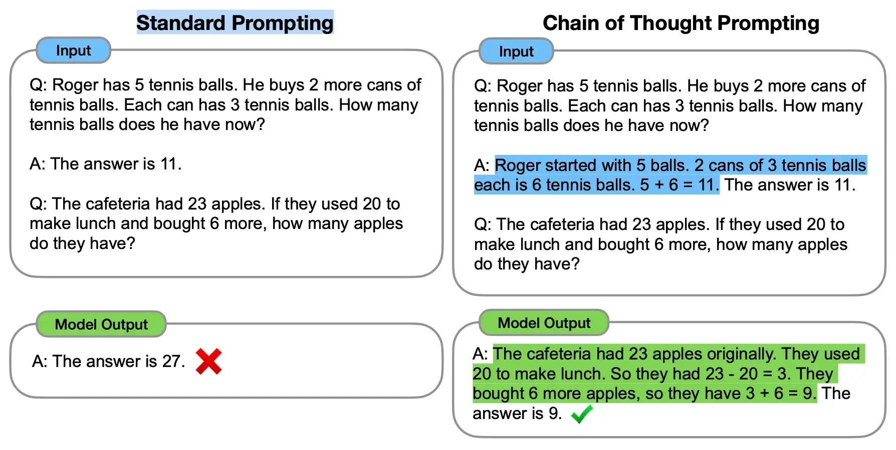

区别于传统的 Prompt 从输入直接到输出的映射 <input——>output> 的方式，CoT 完成了从输入到思维链再到输出的映射，即 <input——>reasoning chain——>output>。如果将使用 CoT 的 Prompt 进行分解，可以更加详细的观察到 CoT 的工作流程。
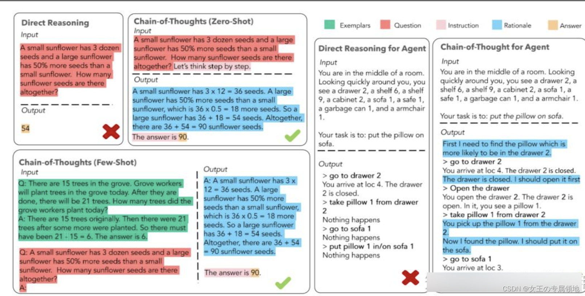

一个完整的包含 CoT 的 Prompt 往往由指令（Instruction），逻辑依据（Rationale），**示例（Exemplars）**三部分组成。

- 指令：用于描述问题并且告知大模型的输出格式；
- 逻辑依据：指 CoT 的中间推理过程，可以包含问题的解决方案、中间推理步骤以及与问题相关的任何外部知识；
- 示例：指以少样本的方式为大模型提供输入输出对的基本格式，每一个示例都包含：问题，推理过程与答案。

以是否包含示例为区分，可以将 CoT 分为 Zero-Shot-CoT 与 Few-Shot-CoT：

- Zero-Shot-CoT 不添加示例而仅仅在指令中添加一行经典的“Let’s think step by step”，就可以“唤醒”大模型的推理能力。
- Few-Shot-Cot 则在示例中详细描述了“解题步骤”，让模型照猫画虎得到推理能力。

CoT 大幅度提高了 LLM 在复杂推理任务上的表现，并且输出的中间步骤方便使用者了解模型的思考过程，提高了大模型推理的可解释性。目前，思维链推理已经成为大模型处理复杂任务的一个常用手段。

### CoT原理和结构

#### 原理

关于 CoT 为什么会生效，目前尚且没有一套被大家广泛接受的普遍理论。但是，有许多论文对 CoT 与大模型的互动进行了一系列实验，类似物理实验与物理理论的关系，在实验中一些有意思的现象或许可以帮助我们理解 CoT 的工作原理：

1. 模型规模小会导致 CoT 失效；
2. 简单的任务 CoT 不会对模型性能带来提升；
3. 训练数据内部彼此相互联结程度的增加可以提升 CoT 的性能；
4. 示例中的错误，或者无效的推理步骤不会导致 CoT 性能的下降；

如果我们对这些现象做一些总结与延申，或许可以认为：
- 首先，CoT 需要大模型具备一些方面“最基础”的知识，如果模型过小则会导致大模型无法理解最基本的“原子知识”，从而也无从谈起进行推理；
- 其次，使用 CoT 可以为一些它理解到的基础知识之间搭起一座桥梁，使得已知信息形成一条“链条”，从而使得大模型不会中途跑偏；
- 最后，CoT 的作用，或许在于强迫模型进行推理，而非教会模型如何完成推理，大模型在完成预训练后就已经具备了推理能力，而 CoT 只是向模型指定了一种输出格式，规范模型让模型逐步生成答案。

##### 什么时候使用CoT？

CoT 应当被用于 20B 以上参数规模的模型之中，并且模型的训练数据应当于任务问题相关且彼此相互有较强的联结。
首从工程的角度而言，CoT 的适用场景抽象一下可以被归纳为三点，分别是:
- 使用大模型（1），
- 任务需要复杂推理（2），
- 参数量的增加无法使得模型性能显著提升（3）。

此外，现有的论文实验也表明，CoT 更加适合复杂的推理任务，比如计算或编程，不太适用于简单的单项选择、序列标记等任务之中，并且 CoT 并不适用于那些参数量较小的模型（20B以下），在小模型中使用 CoT 非常有可能会造成机器幻觉等等问题。

#### COT构造

1. 人工构造：质量高，但人力成本大，不好优化、不好跨任务迁移，如Few-shot CoT；
2. 自动构造：分为 Zero-shot CoT和 Auto CoT等。
但自动的质量一般没有人工的好，导致大模型幻觉问题严重。

##### 人工构建
案例：Few-shot CoT：一个复杂的推理任务，其可以有多种推理路径（即解题思路），最终都能够得到正确的答案。故Self-Consistency在解码过程中，抛弃了greedy decoding的策略，而是使用采样的方式，选择生成不同的推理路径，每个路径对应一个最终答案。
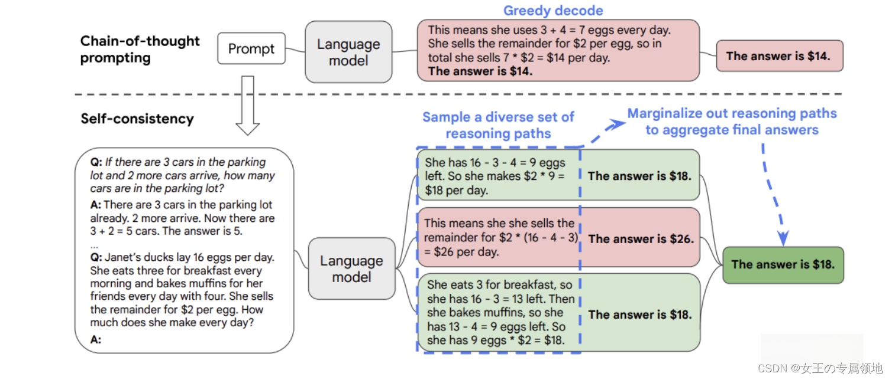
缺点：需要大量人工成本投入。

##### 自动构建
案例1：Zero-shot CoT
前者通过特定的提示文本激发模型在没有示例的情况下生成推理链条；
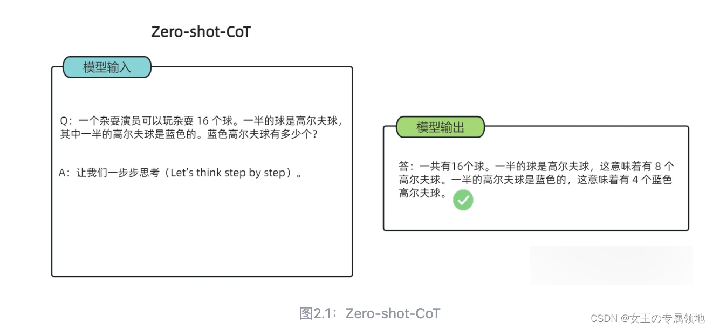 
零样本思维链（Zero Shot Chain of Thought，Zero-shot-CoT）提示过程是对 CoT prompting 的后续研究，引入了一种非常简单的零样本提示。他们发现，通过在问题的结尾附加“Let’s think step by step”这几个词，大语言模型能够生成一个回答问题的思维链。从这个思维链中，他们能够提取更准确的答案。

其实 Zero-shot-CoT 是一个 pipeline。也就是说“Let’s think step by step”这句话，只是通过这个 prompt 让LLM 尽可能生成一些思考过程，然后再将生成的 rationale（理由） 和 question 拼在一起，重新配合一个answer 指向的 prompt 如“The answer is ”来激励模型生成答案。

从技术上讲，完整的零样本思维链（Zero-shot-CoT）过程涉及两个单独的提示/补全结果。在下图中，左侧生成一个思维链，而右侧接收来自第一个提示（包括第一个提示本身）的输出，并从思维链中提取答案。这个第二个提示是一个自我增强的提示。
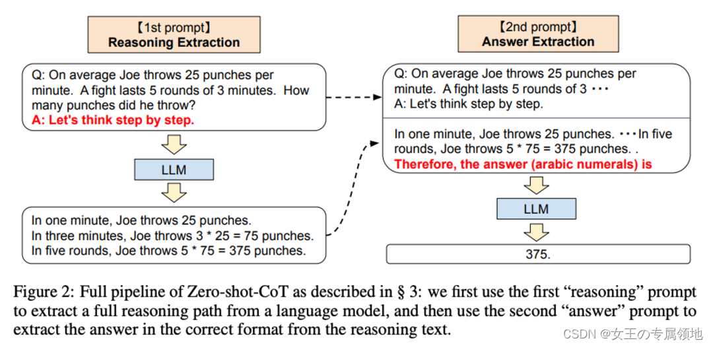
缺点：不稳定

案例2：Auto-CoT
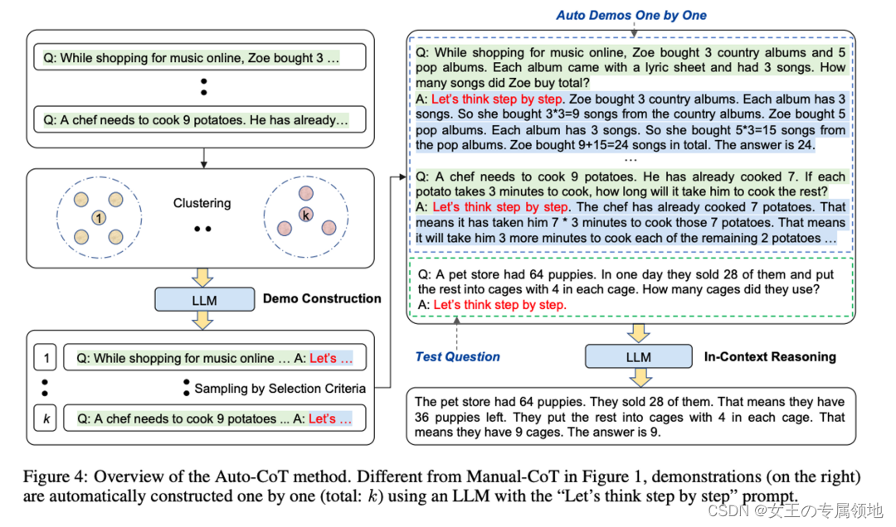
案例2： Auto CoT
使用前者零样本生成的推理链条，并结合示例选择策略，通过少样本学习的方式生成推理链条。

#### 优缺点

##### 优点
CoT 的能力已经被无数工作所验证，归纳为以下四点：

1. 增强了大模型的推理能力：CoT 通过将复杂问题分解为多步骤的子问题，相当显著的增强了大模型的推理能力，也最大限度的降低了大模型忽视求解问题的“关键细节”的现象，使得计算资源总是被分配于求解问题的“核心步骤”；
2. 增强了大模型的可解释性和可信度：对比向大模型输入一个问题大模型为我们仅仅输出一个答案，CoT 使得大模型通过向我们展示“做题过程”，使得我们可以更好的判断大模型在求解当前问题上究竟是如何工作的，同时“做题步骤”的输出，也为我们定位其中错误步骤提供了依据；
3. 增强了大模型的可控性：通过让大模型一步一步输出步骤，我们通过这些步骤的呈现可以对大模型问题求解的过程施加更大的影响，避免大模型成为无法控制的“完全黑盒”；
4. 增强了大模型的灵活性和创造性：仅仅添加一句“Let’s think step by step”，就可以在现有的各种不同的大模型中使用 CoT 方法，同时，CoT 赋予的大模型一步一步思考的能力不仅仅局限于“语言智能”，在科学应用，以及 AI Agent 的构建之中都有用武之地。

##### 缺点
1. 思维链提示需要用户提供一些自然语言形式的推理过程，这可能对用户有一定的负担和要求。
2. 思维链提示可能不适用于所有类型的问题，特别是一些需要专业知识或常识的问题。
3. 思维链提示可能导致ChatGPT过度依赖于给定的推理过程，而忽略了其他可能的解决方案或角度。

#### 应用场景

思维链提示适用于哪些领域？思维链提示主要适用于需要复杂推理的领域，例如:
- 数学
- 常识
- 符号推理等。
思维链提示可以帮助大语言模型生成一系列推理步骤，从而解决多步骤的问题，提高准确率和可解释性。
思维链提示也可以与其他技术结合(ReAct)，例如:
- 行动指令
- 检索
- 组装等，
让大语言模型具备更强的执行能力和知识生成能力。

##### 多模态 CoT

具有很大的应用前景，在 CoT 中，多模态可以分为两类：输入多模态与输出多模态。
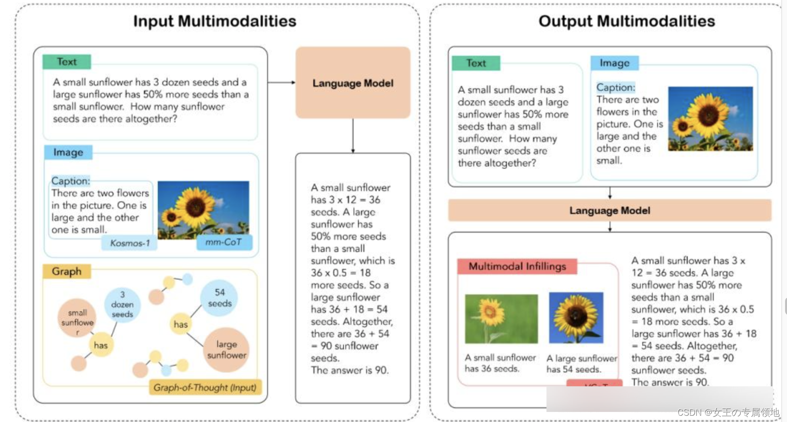

其中，MM-CoT 是输入多模态研究的第一步的工作，MM-CoT 侧重使用微调方法嵌入 CoT，通过将语言和图像合并在一个包含推理生成与答案推理的两阶段的框架中，使用微调大模型赋予输入多模态 CoT 的能力。
基于 MM-CoT，CoT-Input 方法通过对 CoT 生成的思维图进行抽取构建三元组，并使用 GNN 将文本、图像与 CoT 统一，从而生成包含 CoT 信息的最终答案。

而区别于输入多模型，VCoT 解决了一个输出多模态的问题，VCoT 通过以生成图片的“标题”以及识别核心关注点作为图像生成的启动过程，通过递归的方式填充图像信息，从而实现输出多模态。

##### 其他领域

除了多模态 CoT 以外，CoT 目前也已经用于如文本摘要（SumCoT），开放域问答（Self-Prompting LLMs），机器翻译（MAPS），化学（ChemCrow）、医学（Med-PaLM）等等领域
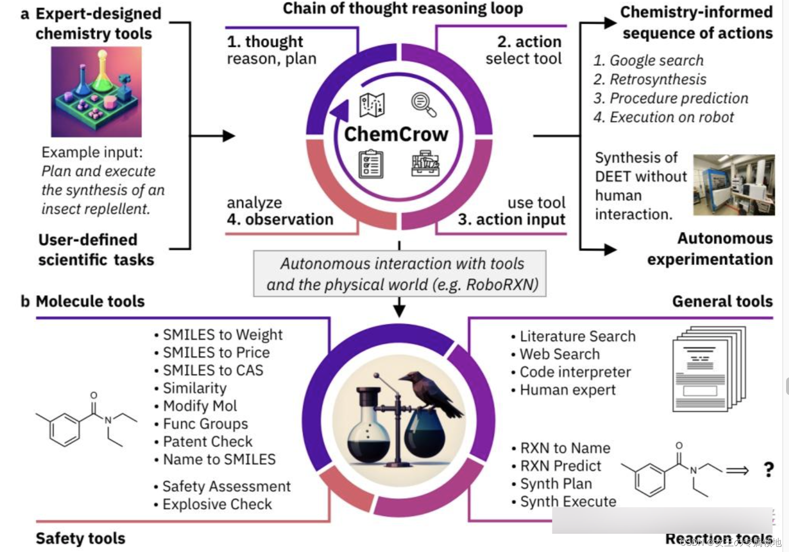

#### 结合Agent
期望通过各种AI 技术构建的 Agent 事实上是一类拥有“自主智能的实体”，可以自主的发现问题、确定目标、构想方案、选择方案、执行方案、检查更新。基于大模型解决问题的“通用性”与预训练得到的“先天知识”，构建的大模型智能体可以被认为具有如下图的结构：
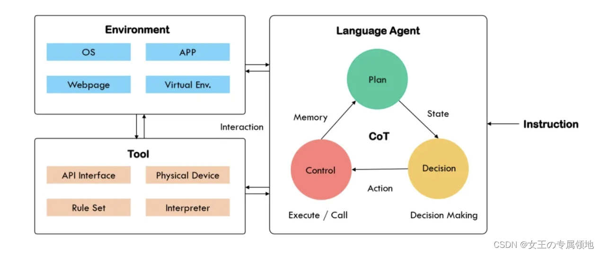

上图中大模型智能体主要由三部分组成，分别是:
- Agent 主体
- 工具
- 环境。

当人类指令输入 Agent 主体后，Agent 主体通过一系列计划、决策与控制，使用工具与外部环境互动。

作为 Agent 主体的大模型是模拟人类智能决策流程的核心，在许多 Agent 需要处理的任务中，Agent 的“先天知识”并不包含解决任务的直接答案，因此 Agent 需要在一系列与外部环境的交互循环中，制定计划，做出决策，执行行动，收到反馈……在一整个计划、决策与控制的循环中，大模型需要具备“感知”，“记忆”与“推理”的能力，如下图所示， CoT 恰恰可以从这三个方面来“赋能” Agent。

##### 感知 CoT
无论是环境的反馈，还是人类的指令，Agent 都需要完成一个对接收到的信息进行“理解”，并依据得到的理解进行意图识别，转化为下一步任务的过程。而使用 CoT 可以大大帮助模型对现有输入进行“感知”，譬如，通过使用“Answer: Let’s think step by step. I see $$, I need to …”的 Prompt，可以让模型逐步关注接收到的信息，对信息进行更好的理解，再如，在机器人控制的场景下，Agent 的决策不可避免的会出现错误，而接受到错误信息的反馈让 Agent 理解错误的原因调整自己的行动也是 Agent 应用于动态场景下的多轮决策任务中的关键能力，感知 CoT 也将加强模型自我纠错的能力。

##### 记忆 CoT
一般而言，大模型智能体通常同时拥有短期记忆与长期记忆的能力。短期记忆一般作为一种时间信息，可以在 Agent 的多轮交互中灵活的改变（因此也被称为工作记忆），短期记忆为大模型提供更加直接的上下文信息支持，因此很自然的可以被建模为一条历史动作链。

相比于短期记忆的“动态性”，长期记忆更多的提供历史事件中的静态信息的记录，是对历史知识更加宏观与抽象的理解，长期记忆可以依赖于大模型中的可训练参数进行构建，也可以通过外部维护的记忆库进行构建。

##### 推理 CoT

除了感知与记忆，借鉴 CoT 的思路让智能体分解任务逐步进行计划与决策以增强智能体解决问题的可靠性。在 Agent 中，CoT 主要的功能在于将计划、行动与观察相互结合，弥合推理与行动之间的差距，显然，推理可以帮助模型制定行动计划处理异常情况，而行动则允许大模型在与外部环境进行交互的同时，收集附加信息支持模型的推理。

譬如，AgentBench 强迫大模型智能体通过“思考”+“行动”步骤完成任务，而行动链技术通过一系列行动历史与未来行动计划帮助智能体进行决策，从而将决策问题转化为 CoT 推理问题。

#### 未来发展

##### 发展路径

CoT 从最简单的“Let’s think step by step”慢慢进化，其发展方向有三条主要的路径，分别是 “Prompt 模式”，“推理结构”以及“应用场景”。

###### Prompt 模式

Prompt 模式主要研究“向大模型输入怎样的 Prompt 可以使得大模型获得更好的推理能力”，关于 Prompt 模式的研究也可以分为两类，分别是指令生成与范例生成。
对于指令生成问题，又可以分为手动指令生成与自动指令生成：

- 手动指令生成模式：① “Let’s think step by step”；② Plan-and-Solve的主要思想在于让模型制定一个将任务分为更小子任务的计划，再让模型一步一步执行计划、解决问题，其 Prompt 为“Let’s first understand the problem and devise a plan to solve the problem. Then, let’s carry out the plan and solve the problem step by step”。
- 自动指令生成：① 自动 Prompt 工程（APE）；② 提示优化（OPRO）；APE 与 OPRO 的核心思想都在于设计了一套机制让大模型通过观察各个候选的 Prompt 的实际任务中的表现，通过最大化表现得分来自动选择最优的 Prompt 。

范例生成也可以分为手动范例生成与自动范例生成

- 手动范例生成方法：① Few-Shot-CoT；② ActivePrompt一种让大模型使用手动生成的范例多次回答问题，再从其中依据如熵、方差等的不确定性度量选择“最不确定”的问题，通过手动注释来加强范例生成的 ActivePrompt 方法，成为了一种介于手动范例生成与自动范例生成之间的范例生成方法。
- 自动范例：Auto-CoT ，Auto-CoT 分为两个阶段：（1）问题聚类，对任务数据集进行聚类（2）示例采样：从每个聚类中心中选择一个代表性问题使用 Zero-Shot-CoT 生成思维链作为示例。

###### 推理结构

除了研究“什么样的 Prompt 会诱导出更好的 CoT 能力以外”，还有很大一部分研究者关注于 CoT 本身的结构问题，主要的研究思路包含 “CoT 构造”、“推理聚合”以及 “CoT 验证”。

CoT构造
CoT 构造主要将传统线形，链式的 CoT 转化为如表格、树状、图状格式，代表工作有非常出名的 PoT，Tab-CoT，ToT 以及 GoT-Rationale，下面这张图非常清晰的展示了这四种方法的异同：
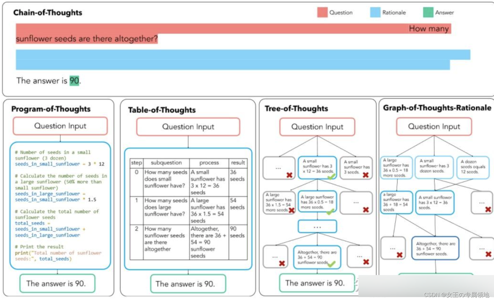

- PoT，其中 P 指 Programm 即程序，PoT 的思想也非常简单，对思维链中大模型有可能出错的一些计算问题，让大模型生成出编程语言在解释器中运行，以将复杂计算与模型的文本生成解耦。
  目前可以通过code interpreter更好的实现。

- Tab-CoT，其中 Tab 指 Tabular 表格，在 ToT 中，研究者迫使大模型在每一步的推理中记录一个“∣步数∣子问题∣过程∣结果∣”的推理表格，并让大模型在推理时从生成的表格中提取答案，从而增强大模型的推理能力。

- ToT，其中 T 指 Tree 即思维树，简单理解就是将 CoT 的链式结构扩展为树形结构。ToT 让大模型在解决子问题时生成多个不同的答案选择，通过此建立的树形结构让大模型可以展望未来确定下一步的决策并且通过追溯来纠正历史决策。

- GoT，GoT 系统的核心在于一个“控制器”，控制器处理对图的操作（GoO）以及图状态推理（GRS），其中 GoO 用于将一个给定的任务进行图分解，将一个任务分解为相互连接的节点-边关系，而 GRS 则负责维护大模型在 GoO 生成的图上的推理过程，记录当前步的状态，决策历史等等信息。

##### 推理聚合
除了各种 XoT 以外，对于推理过程的“解码”问题，也有一些工作进行了研究。其中，推理聚合的代表性工作是 Self-consistency CoT。Self-consistency CoT 使用手动设计的 Prompt 生成采样一组不同的推理路径，再通过“多数投票”找到推理步骤中“最一致”的路径，使用这条解码路径驱动原始的贪心解码方式来提示 CoT 性能。

CoT 验证
最后，在针对推理结构的研究，还有一类是 CoT 验证，CoT 验证开始侧重于通过多轮提问，让大模型进行“自我验证”，在前向后向的反复问答中让大模型可以验证自己的回答，而伴随着 CoT 验证的发展，也有工作开始引入“外部工具”对 CoT 中的信息进行验证，例如信息检索、计算器、计算机程序等等。

CoT 验证最经典的工作即是自我验证（Self-Verification），自我验证有两个步骤，分别是（1）对多个候选的推理路径进行采样；（2）给定问题结论让大模型验证条件是否满足结论，并根据验证分数对候选结论进行排序。 ***这个在o1 最新模型中就有使用，四个例子全部正确的情况下才采纳结果***
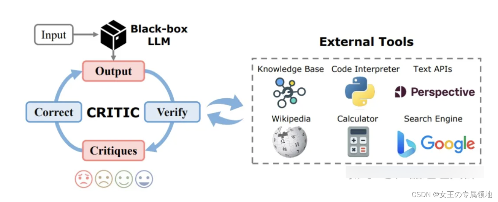
而引入外部工具的 CoT 验证的代表性工作譬如 CRITIC 框架，CRITIC 使得大模型可以交互式的引入外部工具来验证与修改自己的答案输出，经过大模型输出，外部工具验证，验证结果反馈，反馈修改四个循环的步骤加强 CoT 输出的可靠性。而将 CRITIC 的思想进一步推向机制，即出现了任务自适应与流程自动化的 AuRoRA，AuRoRA 从多个来源提取相关知识，将不同来源的知识进行组合、检查与提炼来修改初始 CoT，以提示 CoT 的准确性与逻辑性。

而从理论角度，一篇来自斯坦福的论文《Why think step-by-step? reasoning emerges from the locality of experience》揭示了**当大模型的训练数据表现出了变量的局部簇结构（Local Clusters of Variables）**时，CoT 将会展现极好的效果。而变量的局部簇主要指训练数据中变量之间有着强的相互作用，相互影响的关系。

此外，也有研究指出，当给予大模型的示例之间彼此之间互相区分并不相同时，也有助于提升 CoT 的性能。同时，逻辑依据是否与问题相关，逻辑推理步骤的顺序也会显著影响 CoT 的性能。另外一个有趣的发现是，使用代码数据训练大模型，或者使用符合 CoT 格式的数据训练模型也有助于提升 CoT 的性能。总结一下:CoT 应当被用于 20B 以上参数规模的模型之中，并且模型的训练数据应当于任务问题相关且彼此相互有较强的联结。

### 论证结果
思维链已被证明对于算术、常识和符号推理等任务的结果有所改进特别是，在GSM8K2基准测试上，PaLM 540B3的提示达到了57%的解决率准确性。
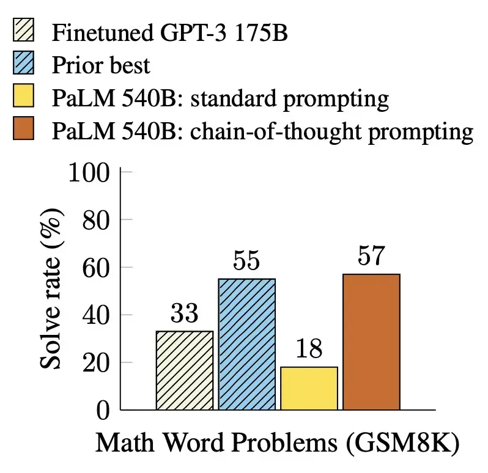

#### 限制

思维链必须在模型规模足够大时才能涌现。
在 Jason Wei 等的研究中，PaLM 在扩展到 540B 参数时，与思维链提示结合，才表现出了先进的性能。一些小规模模型，思维链并没有太大的影响，能力提升也不会很大。
谷歌大脑的研究人员认为，策略问题需要大量的世界知识，而小型模型没有足够的参数来记忆这些世界知识，所以也不太可能产生正确的推理步骤。

但问题是，能落地到产业的模型，规模必然不会太大，思维链拆解了更多的步骤、用到更多的计算资源，相当于更加耗费脑力，很多研究机构和企业是负担不起 175B 参数以上的大模型。

所以思维链必须要探索，如何在较小的模型中进行推理，降低实际应用的成本。

2. 思维链的应用领域是有限的
目前，思维链只是在一些有限的领域，比如数学问题，五个常识推理基准（CommonsenseQA，StrategyQA，Date Understanding 和 Sports Understanding 以及 SayCan）上显现出作用，其他类型的任务，像是机器翻译，性能提升效果还有待评估。

而且，相关研究用到的模型（GPT-3 API）或数据集，都是半公开或不公开的，这就使其难以被复现和验证。严谨来看，思维链的效果还需要被进一步探索，才能下定论。

即使有思维链提示，大语言模型依然不能解决小学水平的数学问题。
没有思维链，数学推理是指定不行。但有了思维链，大语言模型也可能出现错误推理，尤其是非常简单的计算错误。Jason Wei 等的论文中，曾展示过在 GSM8K 的一个子集中，大语言模型出现了 8% 的计算错误，比如6 * 13 = 68（正确答案是78）。

这说明，即使有了思维链，大语言模型还是没有真正理解数学逻辑，不知道加减乘除的真实意义，只是通过更精细的叠加来“照葫芦画瓢”，所以，对于有精确要求的任务，还要进一步探索新的技术。

思维链确实增强了大语言模型的能力，但逻辑推理仍然是大语言模型的弱项，等待着更多突破。

