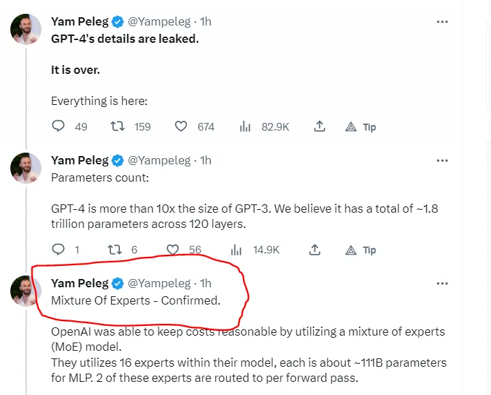
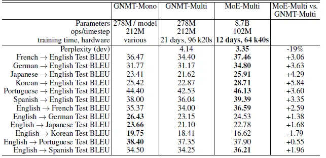

### MoE架构

这条关于 GPT4 架构的推文

它谈到了这个术语，称为 Mix of Experts。从这篇论文中有相同的理解:
[Towards Understanding Mixture of Experts in Deep Learning](https://arxiv.org/pdf/2208.02813.pdf)

深度学习使计算机能够从大量数据中学习复杂的模式，从而彻底改变了从图像识别到自然语言处理的许多领域。深度学习的关键组成部分之一是神经网络架构，它定义了数据如何流经模型以及模型如何从数据中学习。其中一种架构是 Mixture-of-Experts （MoE） 模型，该模型在各种任务中取得了重大成功。然而，尽管在实证上取得了成功，但对 MoE 模型的理论理解仍然难以捉摸。

MoE模型是一种集成学习的方法，它结合了多个“专家”模型的预测，每个模型都专注于数据的特定部分。就像是神经网络世界中的一种团队合作技术。想象一下，把一项大任务分解成更小的部分，让不同的专家来处理每个部分。然后，有一个聪明的法官，他根据情况决定遵循哪位专家的建议，所有这些建议都融合在一起。
尽管它最初是用神经网络来解释的，但你可以将这个想法用于任何类型的专家或模型。这有点像你把不同的味道结合在一起做一道美味的菜，这属于一组很酷的综合学习方法，称为元学习。

### 大语言模型的技术背景前提

- 神经网络的吸收信息的容量（capacity）受限于参数数目。
- 条件计算（conditional computation）**针对于每个样本， ​激活网络的部分子网络进行计算**，它在理论上已证明，可以作为一种显著增加模型容量的方法。
- 在实际中，在牺牲少量计算效率的情况下，实现了 1000 倍的模型容量（model capacity） 的提升。
- 引入了稀疏门控专家混合层（Sparsely-Gated Mixture-of-Experts Layer），包括数以千计的前馈子网络。对于每一个样本，有一个可训练的门控网络（gating network）会计算这些专家（指前馈子网络）的稀疏组合。
- 把专家混合（MoE）应用于语言建模和机器翻译任务中，对于这些任务，从训练语料库中吸收的巨量知识，是十分关键的。
- 在我们提出的模型架构里，MoE 包含 1370 亿个参数，以卷积的方式放在堆叠 LSTM 层之间。
- 在大型语言建模和及其翻译的基准测试中，该模型以更少的计算成本，实现了比最先进方法更好的结果。

##### 条件计算

充分利用训练数据和模型大小的规模，一直以来都是深度学习成功的关键。

- 当训练集足够大，增加神经网络的容量（即参数数目），可以得到更高的预测准确度。
- 对于传统的深度学习模型，对每一个样本都会激活整个模型，这会导致在训练成本上，以大约二次方的速度增长，因为模型大小和训练样本数目都增加了。
- 当前计算能力和分布式计算的进展，并不能满足这样的需求。

因此有很多工作提出了各种形式的条件计算，它们在不显著增加计算成本的情况下**，尽量增加模型的容量**。

- 在这些算法里，以每个样本为基础（on a per-example basis），会激活或冻结网络中的大部分。
- 这种门控决策机制，可以是二进制的，也可以是稀疏而连续的；可以是随机性的，也可以是确定性的。
- 门控决策通过有各种形式的强化学习和反向传播来训练。

##### 机器翻译为例
这里使用的MoE模型是GNMT的修改版本。

为了减少计算，编码器和解码器中的LSTM层的数量分别从9和8减少到3和2。

MoE层被插入编码器（在层2和3之间）和解码器（在层1和2之间）中。每个MoE层包含多达2048名专家，每个专家都有大约200万个参数，总共为模型增加了大约80亿个参数。

在Google Production数据集上，MoE模型在训练了六分之一的时间后，测试BLEU得分也提高了1.01。

### 结论

- 该工作是一个展现基于深度网络的条件计算的重大胜利。
- 涉及设计考虑、条件计算的挑战、从算法和工程上的解决方案。
- 虽然聚焦在文本领域上，条件计算仍然可以在其他领域发挥作用。期望有更多条件计算的实现和应用。