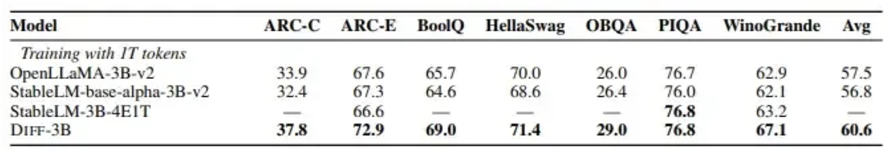

## DIFF Transformer
微软 AI 和清华大学的研究人员提出了一种名为差分 Transformer（DIFF Transformer） 的新架构，旨在提高大语言模型的性能。该模型改进了模型处理上下文，并尽可能减少了无关信息的干扰，从而增强注意力机制。

DIFF Transformer 的关键特性是其差分注意力机制。它通过对比两张独立的注意力图来计算注意力，这样模型就能更有效地关注输入的相关部分。这一改动提高了模型的准确性，特别是在问答和文本摘要等任务中的准确度。

该架构还提高了可扩展性，以更少的训练资源实现了与大型模型类似的性能。这种效率有利于处理较长的数据序列，使其很适合需要一次处理大量信息的任务。

实验表明，DIFF Transformer 在语言建模和信息检索等任务中都超越了传统 Transformer，在大型语言模型中提供了更高的性能和效率。它的设计增强了长上下文建模、关键信息检索、幻觉缓解和上下文学习等实际应用，同时还减少了激活异常值。这些改进提高了跨不同数据集的准确性，并提高了对输入顺序变化的鲁棒性，使 DIFF Transformer 更适合低资源环境。

下表将 DIFF Transformer 的零样本性能与几个经过良好训练的 Transformer 模型做了对比，对比模型包括 OpenLLaMA-v2-3B、StableLM-base-alpha-3B-v2 和 StableLM-3B-4E1T，最后 DIFF Transformer 显示出了更好或相当的结果。

相关评论和观点：

-   虽然谷歌的 Transformer 可能已经提到了“注意力就是你所需要的一切”，但微软和清华大学却带着 DIFF Transformer 来了，说“稀疏注意力就是你所需要的一切”。
-   diff Transformer 有一个小小的权衡，它有两倍的 key heads。

围绕 DIFF Transformer 的讨论强调了计算成本和预测准确性之间的权衡。该模型需要执行两次注意力操作，这可能会减慢训练和推理的速度，但有人猜测这是否可以以更少的训练迭代或更少的数据带来更好的结果。

## 稀疏注意力机制（ sparse attention mechanism）

阿里云推出了全新升级的 Qwen2.5-Turbo 大型语言模型，该模型拥有 100 万个 Token 的惊人上下文长度。
Qwen2.5-Turbo 模型在密钥检索任务中实现了 100% 的准确性，并且在长文本理解能力方面优于 GPT-4 等模型。在 RULER 长文本基准测试中，它获得了令人印象深刻的 93.1 分，而 GPT-4 仅获得 91.6 分，GLM4-9B-1M 获得 89.9 分。除了能够处理长文本外，Qwen2.5-Turbo 在短文本处理方面也表现出色。它在短文本基准测试中的性能与 GPT-4o-mini 和 Qwen2.5-14B-Instruct 模型相当。

***通过采用稀疏注意力机制，Qwen2.5-Turbo 模型将第一个 100 万 Token 的处理时间从 4.9 分钟缩短到仅 68 秒，推理速度提高了 4.3 倍 ***

阿里云为 Qwen2.5-Turbo 模型准备了一系列演示，展示了其在深度理解长篇小说、代码辅助和阅读多篇论文方面的应用。例如，在一位用户上传了包含 690,000 个 token 的中国小说三部曲《三体》后，该模型成功地用英文总结了每本书的情节。

[qwen2.5-turbo官方介绍](https://qwenlm.github.io/blog/qwen2.5-turbo/)
[qwen2.5-turbo在线演示网址](https://huggingface.co/spaces/Qwen/Qwen2.5-Turbo-1M-Demo)

## 总结对比

在做RAG的解决方案中，我们讨论过很多方法，包括contextual RAG： 通过给chunk做一个上下文总结，让chunk内容保持尽可能的连贯和连续。通过graphrag来形成社区，对整体内容的把握和总结。
而这两种模型层面的更新，也是一个解决长文本的方法。后续发展我们拭目以待。

